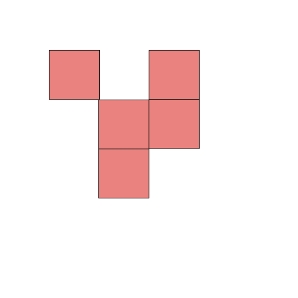

## The nth project on Conway's Game of Life

One of the prettier implementations of the game of life than others found on the web.
This version of the game is built with just-javascript, no **blazingly-fast** frameworks were used.

Thanks to the late John Conway for this discovery of his (amongst a lot of other great works of his).
PRs are always welcome.

try it out [🔗](https://game-of-life-peach-zeta.vercel.app/)

### Instructions

*I wanted to keep stuff minimal, so refer here for trying out keyboard commands (it is pretty strightforward anyways)*

|   controls     |      description             |
|----------------|------------------------------|
|   \<SPC\>      |  pause/play                  |
|     .          |    change theme              |
|     c          |   clear the board            |
|     r          |  reset board                 |
|\<left-click\>  | make alive multiple cells    |
|\<right-click\> | toggle state of one cell     |

Have fun.
